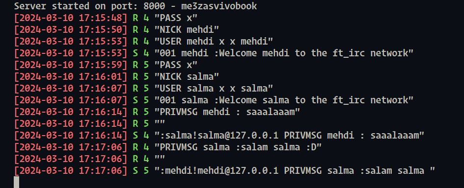
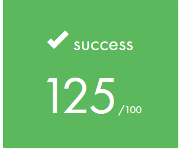

<h1 align="center"> ft_irc - Internet Relay Chat </h1>

	

## Overview

This project involves creating your own IRC (Internet Relay Chat) server using C++ 98. IRC is a text-based communication protocol widely used for real-time messaging on the Internet. The server you develop will allow users to connect through IRC clients, exchange direct messages, and participate in group channels. Understanding and implementing protocols like IRC can provide valuable insights into networking and system-level programming.

## What is IRC?

IRC, or Internet Relay Chat, is a communication protocol that enables real-time text messaging over the Internet. It facilitates both public and private communication, allowing users to exchange direct messages and join group channels. IRC operates on a client-server model, where IRC clients connect to IRC servers to participate in conversations and exchange data.

### Why IRC is Cool?

- **Real-time Communication**: IRC offers instantaneous communication, making it ideal for situations where quick responses are essential.
- **Community Engagement**: It fosters a sense of community by allowing users to join channels dedicated to specific topics or interests.
- **Customization**: Users can customize their IRC experience by joining channels of their choice and interacting with like-minded individuals.
- **Lightweight Protocol**: IRC is lightweight and efficient, making it suitable for low-bandwidth environments and older hardware.

### Usage of IRC

- **Twitch**: Although primarily known for streaming, Twitch originally utilized IRC for its chat functionality. Even today, Twitch chat operates on an IRC backend, showcasing the protocol's enduring relevance.
- **Open Source Projects**: IRC remains a popular choice for communication within open-source communities and development projects.
- **Tech Support Channels**: Many online tech support communities utilize IRC channels to provide real-time assistance and troubleshooting to users.

### History and Knowledge

IRC has a rich history dating back to the late 1980s when it was developed by Jarkko Oikarinen. Initially designed for communication within the Finnish university system, IRC quickly gained popularity and spread globally. Throughout the 1990s and early 2000s, IRC served as one of the primary means of online communication, predating modern social media platforms.

Despite the rise of alternative messaging platforms, IRC continues to thrive in certain niches due to its simplicity, reliability, and robustness. It has inspired the development of countless chat applications and remains a foundational protocol for internet communication.

## Project Goals

The main goal of this project is to develop a functional IRC server capable of handling multiple clients simultaneously. The server should adhere to established standards and protocols, ensuring compatibility with IRC clients. Here's a breakdown of the project requirements and expected skills:

## Skills Required

- **C++ Programming**: Proficiency in C++ 98 is essential for implementing the IRC server.
- **Networking Concepts**: Understanding of networking principles and TCP/IP protocols is required to establish communication between the server and clients.
- **Non-blocking I/O**: Ability to implement non-blocking I/O operations to ensure the server can handle multiple clients without hanging.
- **Error Handling**: Thorough knowledge of error handling techniques to address potential issues such as partial data reception or low bandwidth situations.
- **Makefile**: Skills in creating and managing Makefiles for compiling the source code.
- **Clean Code Practices**: Emphasis on writing clean, readable, and maintainable code is essential for project success.

## Grade

	

